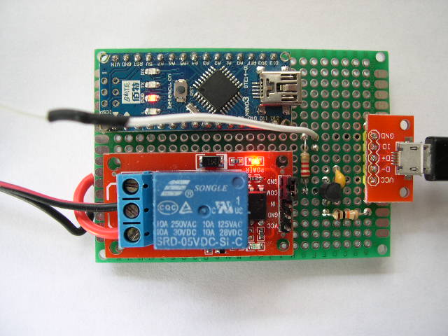
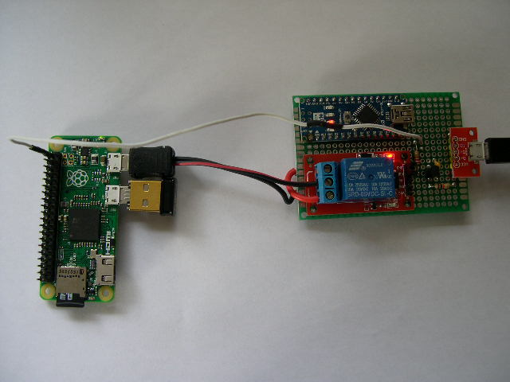

# Watch The Pi

## Introduction

This is a simple watch dog that will power cycle the Raspberry Pi if the Arduino doesn't receive a "pat" in 5 minutes. The power cycle is via a relay (switching 5V) which disconnects the Pi power for 5 seconds.  This is a last resort for getting a locked up Raspberry Pi automatically running again.  Raspberry Pi's should really be properly shutdown before removing the power.

## The Pi

Put the patthedog.py program on your Pi and add the following to your /etc/rc.local file to run it on boot up:

```( python /home/pi/patthedog.py ) &```

This program will send a pulse every 30 seconds. By default it uses GPIO21 which should be connected to the transistor driving the Arduino pin D2.

## The Arduino

The Arduino performs a software reset (on itself) every time it receives a falling edge on pin D2 so that it should never reach the part of the program where it disconnect the Raspberry Pi power for 5 seconds by energising the relay i.e. the Arduino reboots every 30 seconds (the time of the "pat" from the Raspberry Pi) during the delay(300000). The falling edge is important in case the Raspberry Pi locks up half way through a "pat". A connection to the Arduino Reset pin was considered but the Pi could lockup in a state where the Reset pin was permanently set and thus the Pi would never get power cycled.

## Circuit Diagram

Also included is a rudimentary uninterruptable power supply (UPS). If you use a lithium battery, it will be damaged if the voltage per cell drops below 3V.  The UPS can also trigger a Raspberry Pi GPIO pin so that the Raspberry Pi knows if it is running on the battery or not. You do not have to include the UPS if all you want to do is power cycle a Raspberry Pi when it completely locks up.


## Photos





## Alternative solution using a time switch to power cycle the Pi every 24 hours

On boot up, shutdown the Pi after 23hrs 55mins. Mains time switch off for 1 min every 24hrs.

